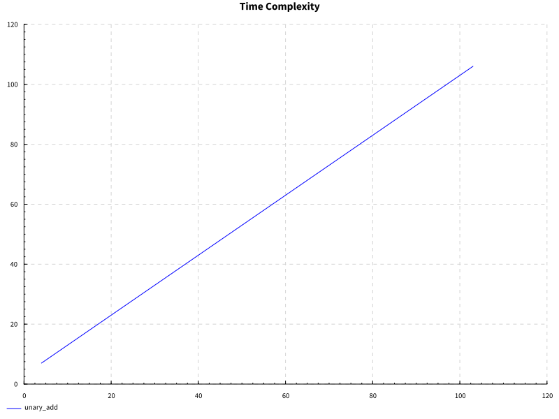
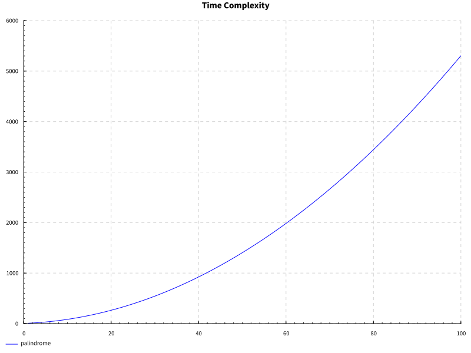
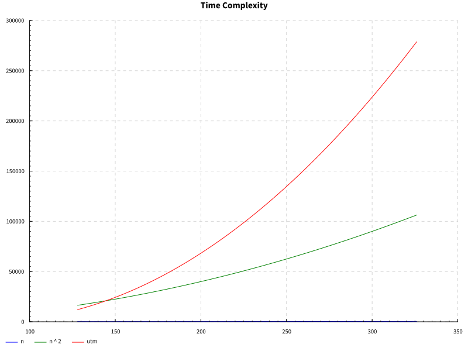

# turing
It's a turing machine, yo......

## Time complexity graph

### Unary add


### Palindrome


### Unary add on universal turing machine (UTM)



## Visualize .yml examples
[turing_machine_viaulization](https://turingmachine.io/)

## Trial and error

### [HSpec 101](https://hspec.github.io/)

### [How to not type `$` all the time](https://typeclasses.com/ghc/block-arguments)


### [How to pretty print test results](https://github.com/hspec/hspec/issues/184#issuecomment-787036570)
```sh
# save the flags to your cabal.project.local
cabal configure --enable-tests --test-show-details=streaming --test-option=--color
```
